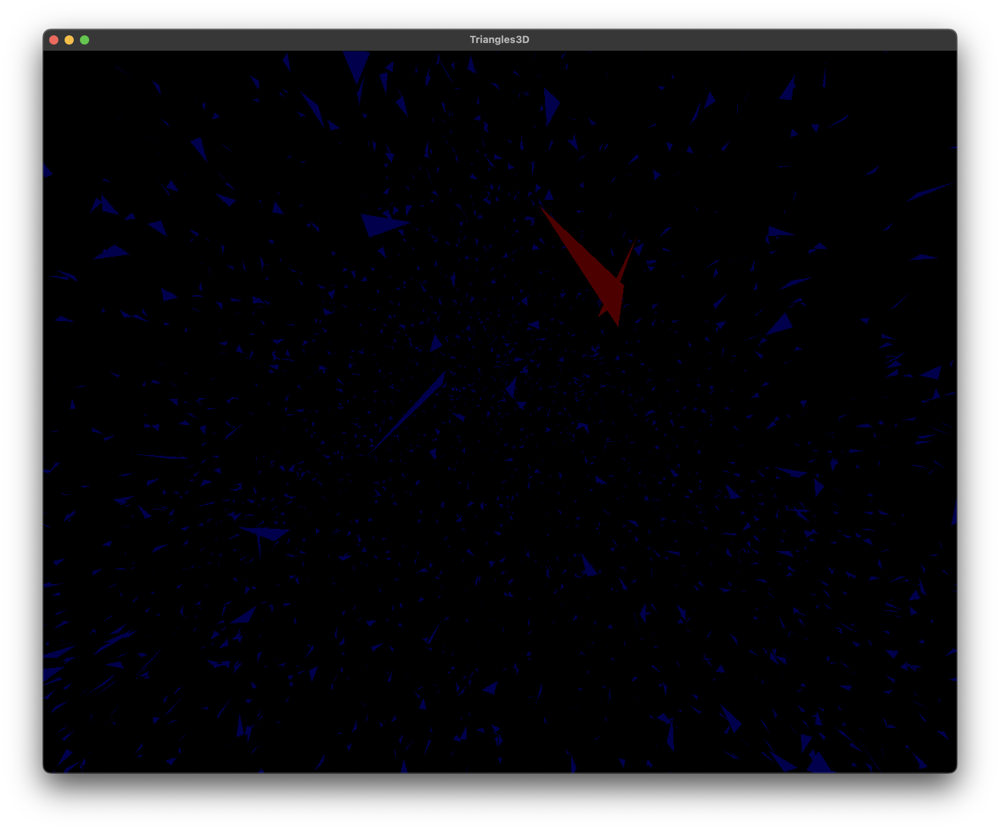

# Triangles3D

Computational task aimed to get intersections of triangles
in 3D space.

## Prerequisites

To build you need the following installed:

Ensure that you installed with your package manager the following:

* Git
* CMake
* C++ compiler + libstdc++ with support of at least C++17
* Python 3
* `pip`

## Build

After installing dependencies listed above, follow these steps:

1. Clone:

   ```sh
   git clone https://github.com/victorbaldin56/Triangles3D.git
   cd Triangles3D
   ```

1. Create virtual environment for Python:

   ```sh
   python3 -m venv .venv
   source .venv/bin/activate
   ```

1. Install Conan:

   ```sh
   pip3 install conan
   conan profile detect --force
   ```

1. Install Conan requirements and toolchain:

   ```sh
   conan install . --output-folder=build --build=missing
   ```

1. Configure CMake:

   ```sh
   cd build
   ```

   CMake >= 3.23

   ```
   cmake .. --preset conan-release
   ```

   CMake < 3.23

   ```
   cmake .. -DCMAKE_TOOLCHAIN_FILE=conan_toolchain.cmake -DCMAKE_BUILD_TYPE=Release
   ```

1. Build:

   ```sh
   cd build
   cmake --build . -j
   ```

   *Note*: if you are using multi-config generator
   (Visual Studio, Ninja Multiconfig, etc),
   replace the last command with:

   ```sh
   cmake --build . --config Release -j
   ```

## Usage

### Command line interface

Input:

* $N$ - the number of triangles
* $3N$ points, coordinates are single-precision floating point numbers.

### Visual mode

To run in visual mode using OpenGL add command line argument `--opengl` to program
invocation, e. g.:

```sh
./driver/triangles --opengl < [input_file]
```

Format of input file remains the same.

In visual mode triangles that have intersections are drawn in red, others in blue,
as shown on example screenshot below. The example scene has been loaded from
[this](tests/e2e/bench/input/test_1.in) file.



Navigation keys W, S, A, D supported. Mouse scroll changes view angle of the camera
between $1$ and $120^{\circ}$. Mouse move rotates camera, single mouse button click
switches on/off mouse following.
